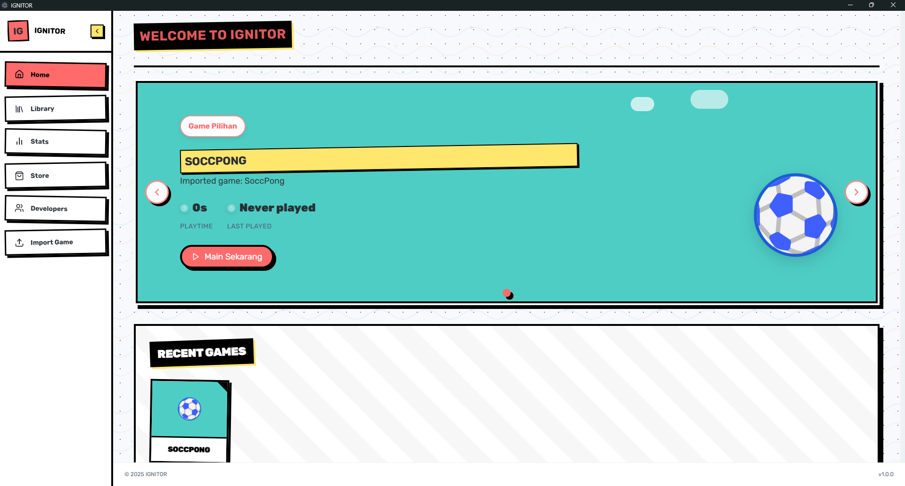

# Ignitor Game Launcher - Website



## 🎮 About Ignitor

Ignitor is a modern game launcher with Neo Brutalism aesthetics that allows users to organize, play, and track their gaming sessions with style. This website serves as an information landing page and showcase for the Ignitor Game Launcher desktop application.

### 🚀 Main Features
- **Game Library**: Organize and access all your games in one place with our intuitive library system
- **Gameplay Stats**: Track your gaming habits, playtime, and achievements with detailed statistics
- **Fast Launch**: Start your games instantly with our optimized launching system

## 📸 Gallery

This website showcases various screenshots from the Ignitor Game Launcher application, including:
- Main dashboard
- Game import feature
- Game library
- Gaming statistics
- Digital store

## 🛠️ Technology

This project is developed using:
- [Next.js](https://nextjs.org) - React framework
- [Tailwind CSS](https://tailwindcss.com) - For styling
- [Lucide Icons](https://lucide.dev) - For icons

## 🚀 Getting Started

Run the development server:

```bash
npm run dev
# or
yarn dev
# or
pnpm dev
# or
bun dev
```

Access [http://localhost:3000](http://localhost:3000) with your browser to see the result.

## 🔗 Important Links

- [Demo Website](https://ignitor.codewithwan.tech)
- [GitHub Repo (Desktop App)](https://github.com/codewithwan/ignitor-electron)

## 📝 License

© 2024 Ignitor Game Launcher Team. All rights reserved.
